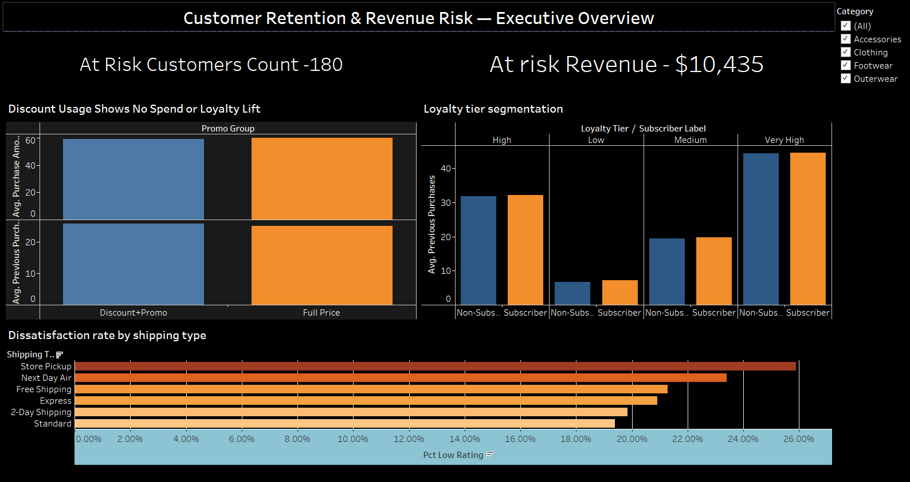

# Customer Behavior & Retention Risk Analysis

An end-to-end data analyst portfolio project covering business problem framing, data cleaning/feature engineering, SQL analysis, and Tableau dashboarding — modeled on real-world analyst workflow.

## Business Problem

Leadership doesn't know which customer segments are most likely to churn, or whether discount/promo spend is actually building loyalty. This project segments customers, tests promo effectiveness against repeat-purchase behavior, and flags a high-value "at-risk" segment for retention marketing.

Full write-up: [`01_business_understanding/business_problem_statement.md`](01_business_understanding/business_problem_statement.md)

## Project Structure

```
customer-behavior-analysis/
├── 01_business_understanding/
│   └── business_problem_statement.md      # Problem, objectives, KPIs, scope
├── 02_data/
│   ├── raw/                                # Original CSV (not committed if large/sensitive)
│   ├── processed/                          # Cleaned CSV + EDA outputs
│   └── data_dictionary.md                  # Schema and derived-field definitions
├── 03_data_preparation/
│   └── data_cleaning_eda.py                # Cleaning, feature engineering, EDA
├── 04_sql_analysis/
│   └── analysis_queries.sql                # Schema DDL + 8 analysis queries
├── 05_tableau/
│   ├── tableau_dashboard_guide.md          # Dashboard/chart spec
│   └── customer_behavior_dashboard.twbx    # (add your saved Tableau workbook here)
├── 06_reporting/
│   └── executive_summary_and_presentation_outline.md
└── README.md
```

## Tech Stack

- **Python** (pandas, matplotlib) — data cleaning & feature engineering
- **SQL** (PostgreSQL-compatible) — structured analysis
- **Tableau** — dashboarding & visual storytelling
- **Markdown** — documentation

## How to Reproduce

```bash
# 1. Clone repo
git clone https://github.com/<your-username>/customer-behavior-analysis.git
cd customer-behavior-analysis

# 2. Add your raw CSV
cp /path/to/customer_shopping_data.csv 02_data/raw/

# 3. Install dependencies
pip install pandas numpy matplotlib

# 4. Run the cleaning/feature engineering pipeline
cd 03_data_preparation
python data_cleaning_eda.py --input ../02_data/raw/customer_shopping_data.csv \
                             --output ../02_data/processed/cleaned_customer_data.csv

# 5. Load cleaned CSV into your SQL database and run 04_sql_analysis/analysis_queries.sql

# 6. Open Tableau, connect to the cleaned CSV or SQL table, and build dashboards
#    per 05_tableau/tableau_dashboard_guide.md
```

## Key Findings
1. Promotional discounts show no measurable business impact. Customers using a discount/promo code spent $59.27 on average vs. $60.13 for full-price customers, with nearly identical purchase history (25.7 vs 25.1 previous orders) and satisfaction (3.74 vs 3.76 / 5) — a pattern that held even among the most loyal customers.
2. Identified a concrete at-risk segment: 180 customers (4.6% of the base) representing $10,435 (4.5%) of revenue — high historical value, but infrequent recent purchasing and below-average satisfaction (2.6–3.0 rating). Segment skews male and concentrated in the Clothing category, giving retention marketing a specific, targetable profile.
3. Shipping type shows a modest link to satisfaction; payment method shows none. Store Pickup and Next Day Air customers report low ratings ~24–26% of the time vs. ~19% for Standard shipping — a real but small effect worth flagging to Ops/CX.
4. Discovered Discount Applied and Promo Code Used are 100% correlated in this dataset — they function as a single lever, not two independent ones — a data-quality insight that shaped how the promo analysis was framed and reported.

## Dashboard
Link to Dashboard - https://public.tableau.com/views/CustomerBehaviorDataAnalysisPortfolioProject/CustomerRetentionRevenueRiskExecutiveOverview?:language=en-GB&:sid=&:redirect=auth&:display_count=n&:origin=viz_share_link



## Author

Akshay Rane — www.linkedin.com/in/akshay-rane-263849213
